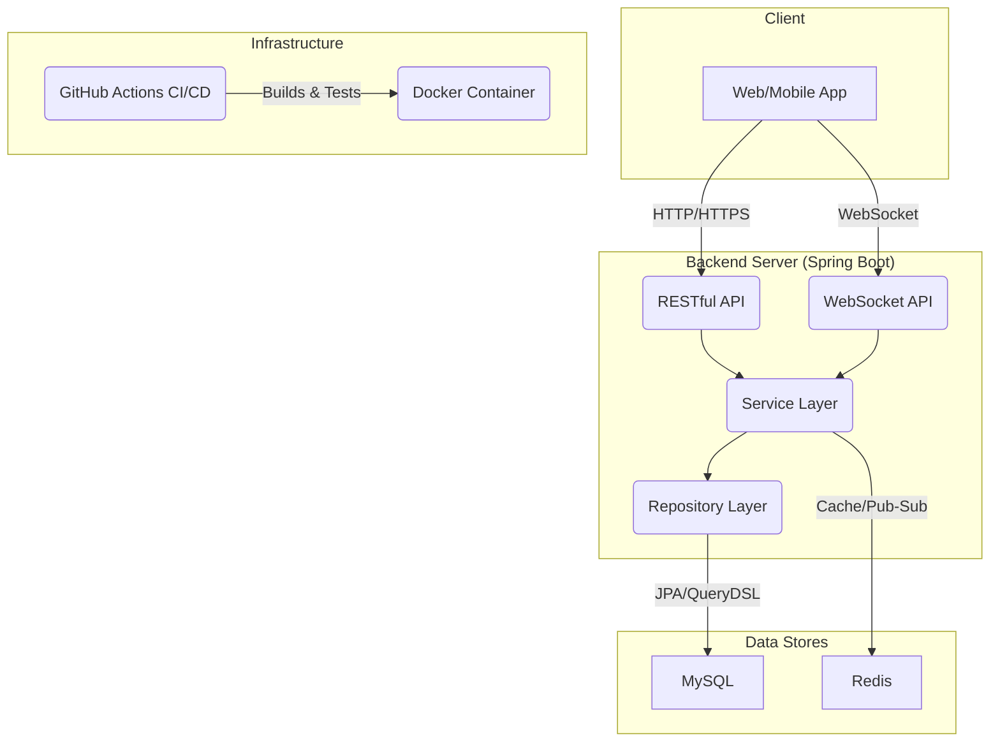
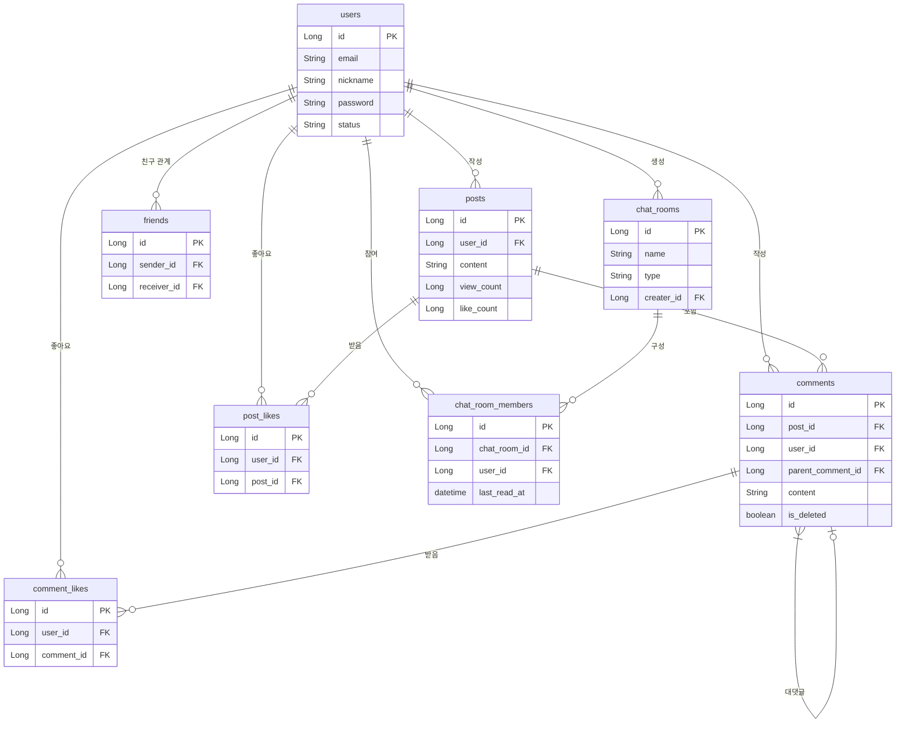

# Morak Social Backend

Morak-Backend는 실시간 상호작용과 소셜 네트워킹에 초점을 맞춘 백엔드 API 서버입니다. 사용자들은 게시물을 통해 자신의 생각을 공유하고, 댓글과 좋아요로 소통하며, 친구를 맺고 실시간 채팅을 통해 더욱 가까워질 수 있습니다.

## 🎯 프로젝트 동기 (Motivation)

단순한 CRUD 기능을 넘어, 대용량 트래픽과 동시성 제어가 중요한 실시간 소셜 서비스를 구축하며 백엔드 개발자로서의 역량을 강화하기 위해 이 프로젝트를 시작했습니다. 특히 WebSocket을 이용한 채팅 기능, 비동기 처리, 데이터베이스 인덱싱 및 쿼리 최적화 등 실무에서 마주할 수 있는 기술적 과제들을 깊이 있게 다루고자 했습니다.

## 🏗️ 시스템 아키텍처

아래는 프로젝트의 주요 구성 요소와 흐름을 나타내는 아키텍처 다이어그램입니다.



## 📋 데이터베이스 스키마 (ERD)

주요 엔티티 간의 관계는 다음과 같습니다.



## ✨ 주요 기능

*   **사용자 인증**: JWT 토큰 기반의 안전한 이메일 가입 및 로그인/로그아웃.
*   **친구 관리**: 친구 요청, 수락/거절, 목록 조회, 사용자 차단 기능.
*   **게시물 (Posts)**: WYSIWYG 에디터를 지원하는 게시물 CRUD, 조회수, 좋아요 기능.
*   **댓글 (Comments)**: 게시물에 대한 대댓글(Nested) 구조를 지원하는 댓글 CRUD.
*   **실시간 채팅**: WebSocket(STOMP)을 활용한 1:1 및 그룹 채팅. Redis Pub/Sub을 통해 여러 서버 인스턴스 간 메시지 전송을 지원합니다.
*   **신고 시스템**: 불適切な 사용자, 게시물, 댓글을 신고하는 기능.
*   **최적화**: QueryDSL을 통한 동적 쿼리 및 복잡한 조회 성능 개선, 주요 데이터에 대한 인덱싱 적용.

## 🛠️ 기술 스택

*   **Language**: `Java 17`
*   **Framework**: `Spring Boot 3`, `Spring Security`, `Spring Data JPA`
*   **Database**: `MySQL`, `Redis`
*   **Query**: `QueryDSL`
*   **Authentication**: `JWT (JSON Web Token)`
*   **Real-time**: `WebSocket (STOMP)`
*   **Build**: `Gradle`
*   **CI/CD**: `GitHub Actions`, `Docker`
*   **API Docs**: `Swagger (OpenAPI 3.0)`

## 💡 API 예시

### 회원가입

**`POST /api/auth/signup`**

**Request Body:**
```json
{
  "email": "user@example.com",
  "password": "password123!",
  "nickname": "사용자123"
}
```
**Response (Success):**
```json
{
  "statusCode": 201,
  "message": "회원가입이 성공적으로 완료되었습니다.",
  "data": null
}
```

### 게시글 작성

**`POST /api/posts`**

**Headers:** `Authorization: Bearer <JWT_TOKEN>`

**Request Body:**
```json
{
  "content": "안녕하세요, 새로운 게시글입니다."
}
```

**Response (Success):**
```json
{
  "statusCode": 201,
  "message": "게시글이 성공적으로 작성되었습니다.",
  "data": {
    "id": 1,
    "content": "안녕하세요, 새로운 게시글입니다.",
    "authorNickname": "사용자123",
    "createdAt": "2024-05-21T10:00:00"
    // ... 기타 정보
  }
}
```

## 🧪 테스트 전략

코드의 안정성과 신뢰성을 보장하기 위해 다양한 테스트를 작성합니다.
*   **Unit Tests**: `JUnit 5`와 `Mockito`를 사용하여 각 서비스 로직과 컴포넌트의 동작을 고립된 환경에서 검증합니다.
*   **Integration Tests**: `@SpringBootTest`를 활용하여 실제 데이터베이스 및 외부 의존성과의 통합을 테스트하고, API 엔드포인트가 의도대로 작동하는지 확인합니다.

## 🔄 CI/CD 및 배포

*   **CI (Continuous Integration)**: `GitHub Actions`를 통해 main 브랜치에 코드가 푸시될 때마다 Gradle 빌드 및 테스트를 자동화하여 코드 품질을 유지합니다.
*   **CD (Continuous Deployment)**: CI가 성공적으로 완료되면 `Dockerfile`을 사용하여 프로젝트를 컨테이너 이미지로 빌드합니다. 이 이미지는 Docker Hub에 푸시되거나 클라우드 환경(예: AWS, GCP)에 배포될 수 있습니다.

## 🚀 시작하기

### 1. 전제 조건
*   Java 17
*   Gradle 8.1.1+
*   MySQL & Redis

### 2. 프로젝트 실행
```bash
# 1. 클론 및 이동
git clone https://github.com/your-username/morak-backend.git
cd morak-backend

# 2. application.properties 설정
# src/main/resources/application.properties.example 파일을 복사하여
# application.properties 파일을 생성하고 환경에 맞게 수정합니다.

# 3. 빌드 및 실행
./gradlew bootRun
```
애플리케이션 실행 후, `http://localhost:8080/swagger-ui/index.html`에서 API 문서를 확인할 수 있습니다.

## 🗺️ 로드맵 (향후 개선 계획)

*   **검색 엔진 도입**: `Elasticsearch`를 연동하여 전문(Full-text) 검색 기능 구현.
*   **소셜 로그인**: OAuth2를 이용한 Google, Kakao 등 소셜 로그인 기능 추가.
*   **알림 기능**: 친구 요청, 새 댓글, 채팅 메시지 등에 대한 실시간 알림 기능 고도화.
*   **성능 모니터링**: `Prometheus`, `Grafana` 등을 도입하여 애플리케이션 성능 모니터링 환경 구축.