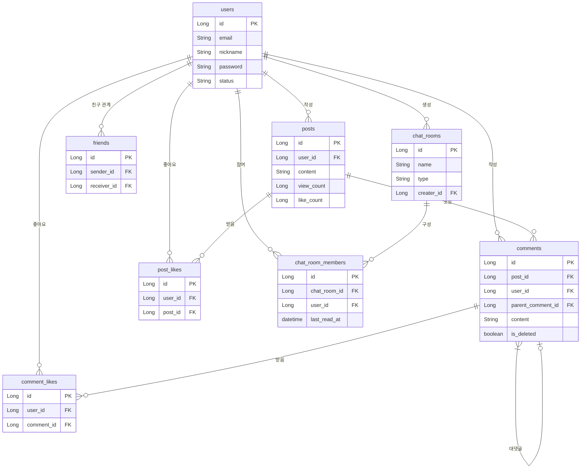

# Morak Social Backend

Morak-Backend는 실시간 상호작용과 소셜 네트워킹에 초점을 맞춘 백엔드 API 서버입니다. 사용자들은 게시물을 통해 자신의 생각을 공유하고, 댓글과 좋아요로 소통하며, 친구를 맺고 실시간 채팅을 통해 더욱 가까워질 수 있습니다.

## 🎯 프로젝트 동기 (Motivation)

단순한 CRUD 기능을 넘어, 대용량 트래픽과 동시성 제어가 중요한 실시간 소셜 서비스를 구축하며 백엔드 개발자로서의 역량을 강화하기 위해 이 프로젝트를 시작했습니다. 특히 WebSocket을 이용한 채팅 기능, 비동기 처리, 데이터베이스 인덱싱 및 쿼리 최적화 등 실무에서 마주할 수 있는 기술적 과제들을 깊이 있게 다루고자 했습니다.

## 🏗️ 시스템 아키텍처

아래는 프로젝트의 주요 구성 요소와 흐름을 나타내는 아키텍처 다이어그램입니다.

```mermaid
graph TD
    subgraph Client
        A[Web/Mobile App]
    end

    subgraph "CI/CD Pipeline"
        H(GitHub Actions - Build & Test) -- Docker Image --> I[Container Registry]
    end

    subgraph "AWS Cloud"
        J(EC2 Instance)
        subgraph "Services on EC2"
            K[Spring Boot App (Docker)]
            L[PostgreSQL Database]
            M[Redis Cache/Pub-Sub]
        end
        J --- K
        J --- L
        J --- M
    end

    A -- HTTP/HTTPS --> J
    A -- WebSocket --> J
    K --> L
    K --> M
    J -- Pull Latest Image & Deploy (.sh script) --> I
```

## 📋 데이터베이스 스키마 (ERD)

주요 엔티티 간의 관계는 다음과 같습니다. (PostgreSQL 기준)



## ✨ 주요 기능

*   **사용자 인증**: JWT 토큰 기반의 안전한 이메일 가입 및 로그인/로그아웃.
*   **친구 관리**: 친구 요청, 수락/거절, 목록 조회, 사용자 차단 기능.
*   **게시물 (Posts)**: 게시물 CRUD, 조회수, 좋아요 기능.
*   **댓글 (Comments)**: 게시물에 대한 대댓글(Nested) 구조를 지원하는 댓글 CRUD.
*   **실시간 채팅**: WebSocket(STOMP)을 활용한 1:1 및 그룹 채팅. Redis Pub/Sub을 통해 여러 서버 인스턴스 간 메시지 전송을 지원합니다.
*   **신고 시스템**: 불량 사용자, 게시물, 댓글을 신고하는 기능.
*   **최적화**: QueryDSL을 통한 동적 쿼리 및 복잡한 조회 성능 개선, 주요 데이터에 대한 인덱싱 적용.

## 🛠️ 기술 스택

*   **Language**: `Java 17`
*   **Framework**: `Spring Boot 3`, `Spring Security`, `Spring Data JPA`
*   **Database**: `PostgreSQL`, `Redis`
*   **Query**: `QueryDSL`
*   **Authentication**: `JWT (JSON Web Token)`
*   **Real-time**: `WebSocket (STOMP)`
*   **Build**: `Gradle`
*   **CI/CD**: `GitHub Actions`, `Docker`
*   **API Docs**: `Swagger (OpenAPI 3.0)`

## 💡 API 예시

### 회원가입

**`POST /api/auth/signup`**

**Request Body:**
```json
{
  "email": "user@example.com",
  "password": "password123!",
  "nickname": "사용자123"
}
```
**Response (Success):**
```json
{
  "statusCode": 201,
  "message": "회원가입이 성공적으로 완료되었습니다.",
  "data": null
}
```

### 게시글 작성

**`POST /api/posts`**

**Headers:** `Authorization: Bearer <JWT_TOKEN>`

**Request Body:**
```json
{
  "content": "안녕하세요, 새로운 게시글입니다."
}
```

**Response (Success):**
```json
{
  "statusCode": 201,
  "message": "게시글이 성공적으로 작성되었습니다.",
  "data": {
    "id": 1,
    "content": "안녕하세요, 새로운 게시글입니다.",
    "authorNickname": "사용자123",
    "createdAt": "2024-05-21T10:00:00"
    // ... 기타 정보
  }
}
```

## 🔄 CI/CD 및 배포

    이 프로젝트는 `GitHub Actions`를 활용한 CI/CD 파이프라인을 구축하여 개발 생산성과 배포의 안정성을 높였습니다.

1.  **CI (Continuous Integration)**: `main` 브랜치로 푸시될 때마다 `GitHub Actions`가 자동으로 트리거되어 코드를 빌드하고 모든 테스트를 실행하여 코드 변경 사항의 통합을 검증합니다.
2.  **Docker 이미지 빌드**: 빌드 및 테스트가 성공하면, `Dockerfile`을 기반으로 애플리케이션의 Docker 이미지를 빌드하고 이를 `Container Registry` (예: Docker Hub 또는 GitHub Container Registry)에 푸시합니다.
3.  **CD (Continuous Deployment on EC2)**: EC2 인스턴스에 배포를 자동화하기 위한 셸 스크립트(`.sh`)가 준비되어 있습니다. 이 스크립트는 EC2 인스턴스에서 실행되어 `Container Registry`에서 최신 Docker 이미지를 풀(pull)하고, 기존 컨테이너를 안전하게 중단한 후 새로운 버전의 애플리케이션을 배포합니다. 이 과정을 통해 빠르고 효율적인 배포 업데이트를 가능하게 합니다.

## 🚀 시작하기

### 1. 전제 조건
*   Java 17
*   Gradle 8.1.1+
*   PostgreSQL & Redis

### 2. 프로젝트 실행
```bash
# 1. 클론 및 이동
git clone https://github.com/your-username/morak-backend.git
cd morak-backend

# 2. application.properties 설정
# src/main/resources/application.properties.example 파일을 복사하여
# application.properties 파일을 생성하고 환경에 맞게 수정합니다.

# PostgreSQL 설정 예시
# spring.datasource.url=jdbc:postgresql://localhost:5432/morak
# spring.datasource.username=your-db-username
# spring.datasource.password=your-db-password

# Redis 설정 예시
# spring.data.redis.host=localhost
# spring.data.redis.port=6379

# JWT 설정 예시
# jwt.secret.key=your-super-secret-key-that-is-long-enough

# 3. 빌드 및 실행
./gradlew bootRun
```
애플리케이션 실행 후, `http://localhost:8080/swagger-ui/index.html`에서 API 문서를 확인할 수 있습니다.

